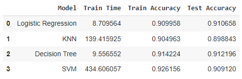
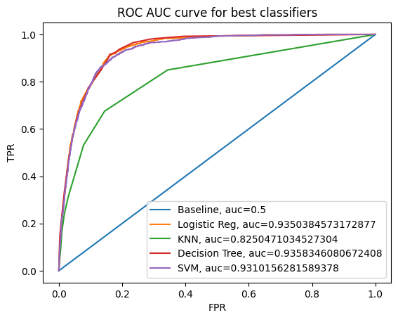

## Banking Marketing Campaign

Compare performance of various classifiers we encountered in this section namely Logistic Regression, KNN, Decision Trees and SVM. 
We will utilize a banking marketing campaign dataset to achieve this. This is a solution for practical assignment 17.1 (BHPCMLAI)

### Summary of findings

Decision Tree came out as the best performing model amongst all the models for this dataset with an accuracy score of 91.2%. This can be seen in the below dataframe snapshot and the ROC curve.

For detailed analysis, please checkout [the jupyter notebook](https://github.com/parthoghosh24/banking_marketing_campaign/blob/main/prompt_III.ipynb)

### Project requirement
- Python3
- Anaconda (if running on local) or something like Google Colaboratory (this project has been built in Google Collaboratory)

### Project structure
- <b><u>data</u></b>: Contains the actual data (bank-additional-full.csv)
- <b><u>images</u></b>: Contains images related to project
- <b><u>README</u></b>: This file
- <b><u>used_car_prediction.ipynb</u></b>: [Jupyter Notebook](https://github.com/parthoghosh24/banking_marketing_campaign/blob/main/prompt_III.ipynb) for the project
